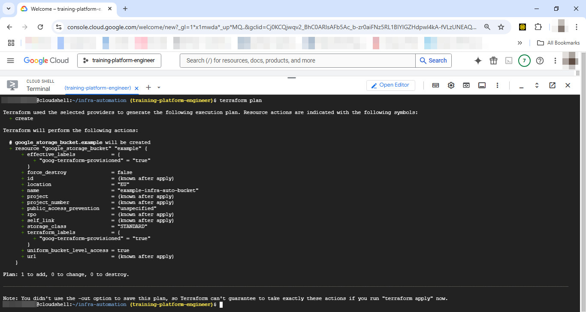
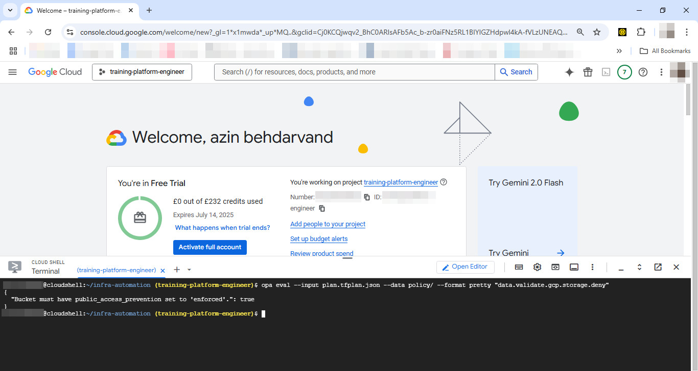
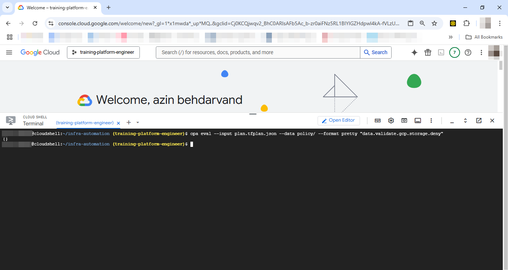

📦 Infrastructure Automation with Terraform & OPA
Automated infrastructure provisioning using Terraform and Open Policy Agent (OPA), enforcing secure bucket policies and ensuring scalable, compliant deployments.
✅ Tested on: Google Cloud Shell
✅ GCP Project: training-platform-engineer
✅ Region: europe-west2
⚙️ What This Project Does
Provisions a secure GCS bucket using Terraform
Enforces compliance using OPA Rego policies
Demonstrates how infrastructure automation and policy-as-code reduce manual errors and secure cloud deployments
Enables a scalable, reproducible approach across 1000+ servers

🌱 Project Structure
infra-automation/
├── main.tf
├── plan.tfplan.json
├── policy/
│   └── deny-public-bucket.rego
└── README.md

🚀 Step-by-Step Installation
✅ 1. Define Terraform Infrastructure
This Terraform script provisions a GCS bucket without enforced public access prevention (to test the OPA policy).
# main.tf

resource "google_storage_bucket" "example" {
  name     = "example-infra-auto-bucket"
  location = "EU"

  uniform_bucket_level_access = true
  public_access_prevention    = "unspecified"

  labels = {
    "goog-terraform-provisioned" = "true"
  }
}

✅ 2. Initialize and Plan Terraform
Run the following commands in Cloud Shell:
terraform init
terraform plan -out=plan.tfplan
terraform show -json plan.tfplan > plan.tfplan.json

✅ 3. Define OPA Rego Policy
This policy denies creating buckets unless public_access_prevention = "enforced":
# policy/deny-public-bucket.rego

package validate.gcp.storage

deny[msg] {
  input.resource_changes[_].change.after.public_access_prevention != "enforced"
  msg := "Bucket must have public_access_prevention set to 'enforced'."
}

✅ 4. Evaluate Terraform Plan with OPA
Run the following:
opa eval --input plan.tfplan.json --data policy/ --format pretty "data.validate.gcp.storage.deny"

🔍 This checks if any bucket resource violates the defined policy.
Expected output:
{
  "Bucket must have public_access_prevention set to 'enforced'.": true
}

✅ Benefits of This Setup
Feature | Benefit
Infrastructure as Code | Reproducible, version-controlled GCP infrastructure
Policy as Code (OPA) | Validates compliance before deployment
Automation | Reduces manual intervention, accelerates deployment
Scalable & Secure | Easily supports 1000+ resources with centralized policy

🧪 Optional: Fix the Violation
To fix the Terraform plan and make it compliant:
public_access_prevention = "enforced"

Re-run the policy check:

terraform plan -out=plan.tfplan
terraform show -json plan.tfplan > plan.tfplan.json
opa eval --input plan.tfplan.json --data policy/ --format pretty "data.validate.gcp.storage.deny"

✅ You should now see an empty result, meaning your plan is compliant.
